## Sarah's proces

### Ontwerper:
Sarah de Moes

#### Je startniveau:
Mijn startniveau zit tussen rood-blauw in. De basis van coderen begrijp ik, maar ik heb nog veel moeite met sommige onderdelen zoals bijvoorbeeld Javascript of het gebruik van @keyframes / animatie.

# Je plan

  
Wat is mijn plan en wat zijn mijn ambities?

  ## Wat is mijn plan?
  Mijn karakter die ik heb uitgekozen is Captain America. Naar een klein onderzoek over dit karakter heb ik gevonden dat Captain America in de "Avenger" reeks een paar keer van kostuum verandert. De veranderingen van kostuums draagt ook een verhaaltje met zich mee.

  Mijn plan is om deze kostuums te showen en het verhaal van elk kostuum te vertellen. Het lijkt mij leuk om het in een stripboek stijl te maken, omdat Captain America is ontstaan in 1941 met het eerste stripboek.

  ### De eerste versie/schets:
  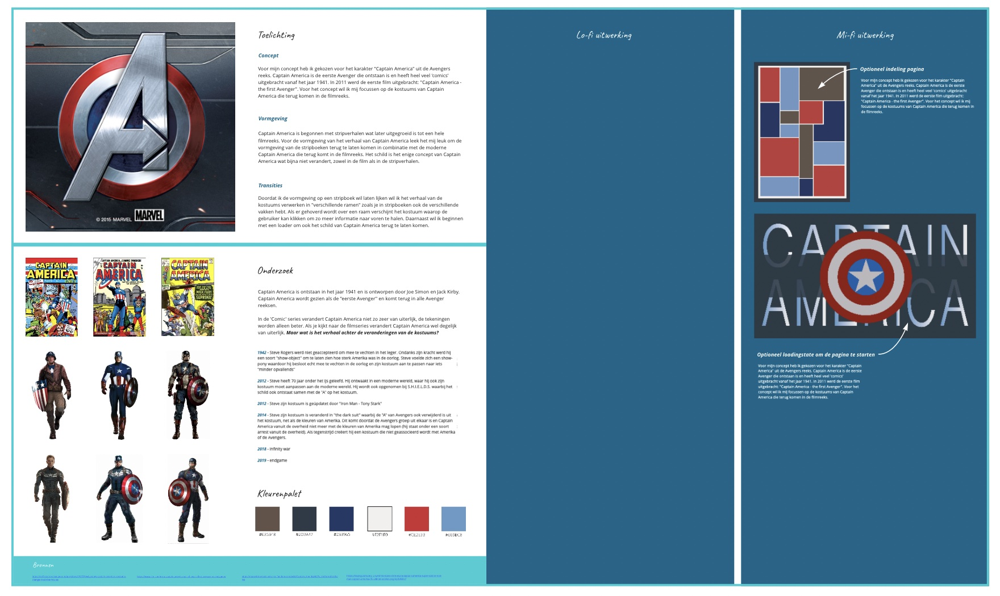

  ### Je ambitie:
  Aan deze technieken/punten wil ik werken:

  - Werken met @keyframes
  - Werken met animaties
  - Illustrator bestanden combineren met HTML & CSS
  - Zo veel mogelijk CSS en zo weinig mogelijk Javascript gebruiken indien dat mogelijk is.
  - Sliders gebruiken
  - Nette code schrijven
  - Veel hovers gebruiken (want dat is cool :))

## Voortgang/Feedback 1

Wat is mijn voortgang na feedbacksessie 1?

  ### Bevinding 1:
  Mijn eerste idee was om een bestaande afbeelding te gebruiken en die te stijlen met CSS zodat ik er een poster van kon maken met hovers. Deze afbeeldingen kwamen niet echt mooi naar voren met de hovers.

  #### Oplossing:
  Uiteindelijk heb ik er voor gekozen om zelf een afbeelding te maken en daar mee te werken. In Adobe Illustrator heb ik een Captain America gemaakt.

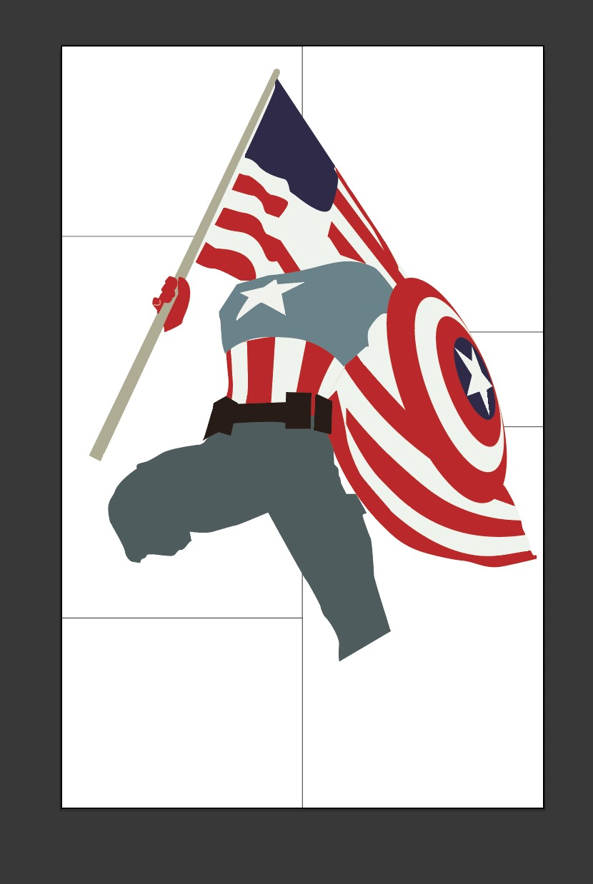

  ### Bevinding 2:
  Tijdens mijn eerste feedbackgesprek met Charlie vond Charlie dat de kleuren niet goed overeen kwamen met het idee van Captain America.

  #### oplossing:
  Ik heb de kleuren gewijzigd van orange/geel naar groen in Illustrator. Nadat ik deze wijziging had gemaakt heb ik het hele kleurenpalet wat ik in eerste instantie wilden gebruiken veranderd naar grijs/zwart/rood en groen.

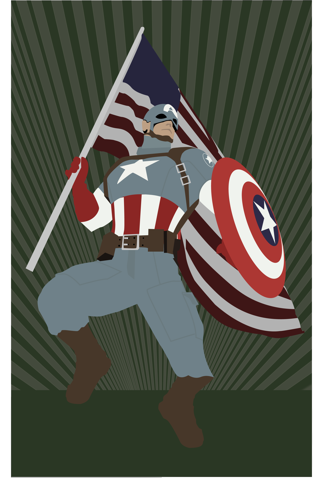

  ### Bevinding 3:
  Mijn idee was om een stripboekpagina na te bootsen omdat Captain America ooit ontstaan is via stripboeken. Om dit te creeren heb ik geprobeerd om een grid te creeren met los staande "sections" die samen een geheel vormen. In Adobe Illustrator heb ik een afbeelding van Captain America getekend. Dit wil ik gebruiken als "voorpagina" van de stripboekpagina. Als de gebruiker over een section hovert moet de section draaien en kan de gebruiker informatie lezen.

  #### Oplossing:
  Het is mij niet gelukt om deze sections te laten flippen zodat de gebruiker informatie kan lezen. Hoe ik dit heb opgelost is om een hover te gebruiken met een link in de hover zodat de gebruiker naar een andere pagina wordt geleidt om informatie te lezen.

  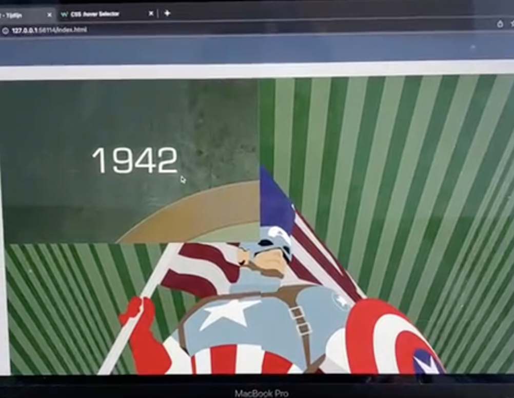

  ### Bevinding 4:
  Ik wilde het Illustrator bestand als SVG op de achtergrond zetten van mijn "stripboekpagina". Het is mij niet gelukt om mijn illustratie om te zetten als SVG.

  #### Oplossing:
  Ik heb de afbeelding als png gemaskert in Illustrator in de width en height van de blokjes die ik gemaakt heb met het grid. Met een "background-image" heb ik deze stukjes afbeelding in elke section gezet zodat het in zijn geheel leek alsof het een complete illustratie was.

  

  ### Bevinding 5:
  Om de poster te maken heb ik allemaal sections gebruikt en met een display:flex proberen naast en onder elkaar te zetten. Deze sections sloten niet echt mooi aan elkaar waardoor mijn afbeelding allemaal gaten kreeg.

  #### Oplossing:
  Na een gesprek met Sanne heeft Sanne me over het gebruik van grids verteld, waardoor mijn afbeelding nu wel mooi aan elkaar zat.

  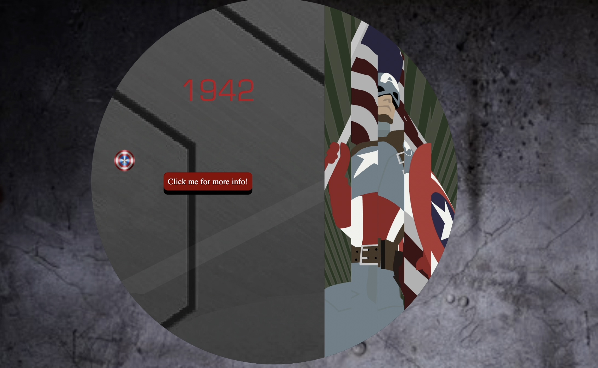

## Voortgang/Feedback 2

Wat is mijn voortgang na feedbacksessie 2?

  ### Bevinding 1:
  De poster beviel mij niet echt. Het nam te veel ruimte in beslag waardoor de navigatie en het idee van de poster een beetje weg viel.

  #### oplossing:
  In plaats van de poster heb ik er voor gekozen om er een slider van te maken.

  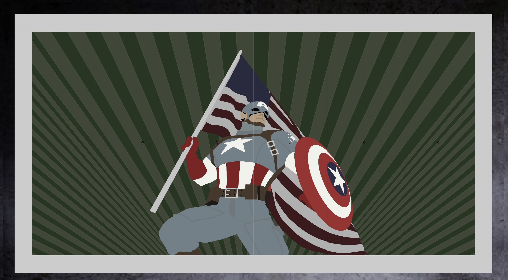
  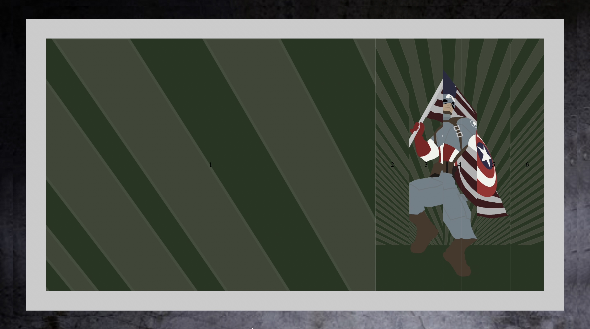

  ### Bevinding 2:
  Als feedback kreeg ik dat het misschien beter zou zijn als ik een startpagina zou maken zodat je niet gelijk op de slider komt.

  #### oplossing:
  Ik heb een startpagina gemaakt met het schild van Captain America. Als er op het schild geklikt wordt komt de gebruiker bij de slider.

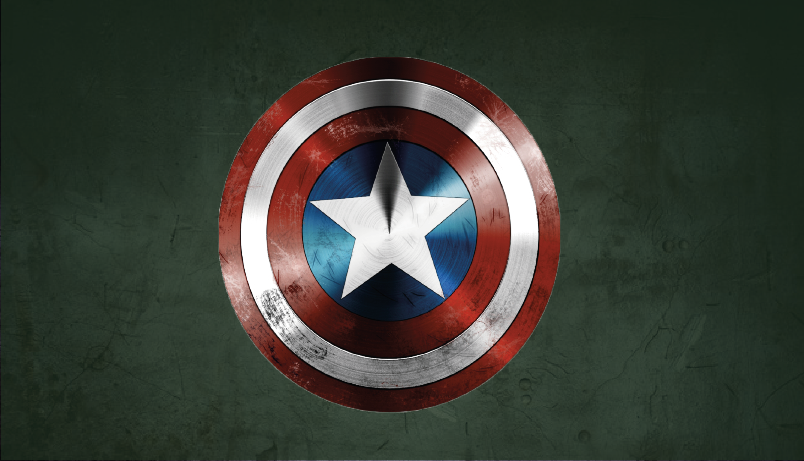

  ### Bevinding 3:
  Als feedback kreeg ik over mijn informatiepagina dat de achtergrond te saai was, doordat ik een witte achtergrond gebruik net als bij de slider.

  #### Oplossing:
  Als oplossing heb ik bedacht om per jaartal die ik gebruik een achtergrond te maken in Illustrator die past bij de film waar het kostuum zich afspeelt.

  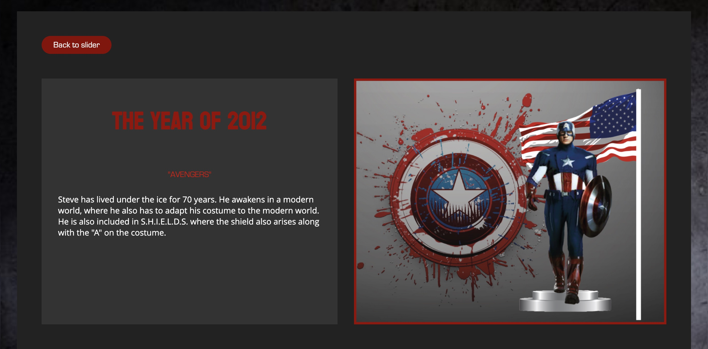

  ### Bevinding 4:
  De startpagina vond ik nog te algemeen en mijn focus lag op het gebruiken van @keyframes en animatie. Dit was nog niet gebeurd.

  #### oplossing:
  Als oplossing had ik bedacht om als startpagina een animatie te maken wat ook meer betrekking had tot Captain America. Ik heb er voor gekozen om een Amerikaanse vlag te gebruiken met een logo van Captain America. Het logo is geanimeerd zodat het van klein naar groot gaat en daarna verdwijnt. Om een link te maken naar de slider komt na het logo een Amerikaanse vlag waar op geklikt kan worden.

  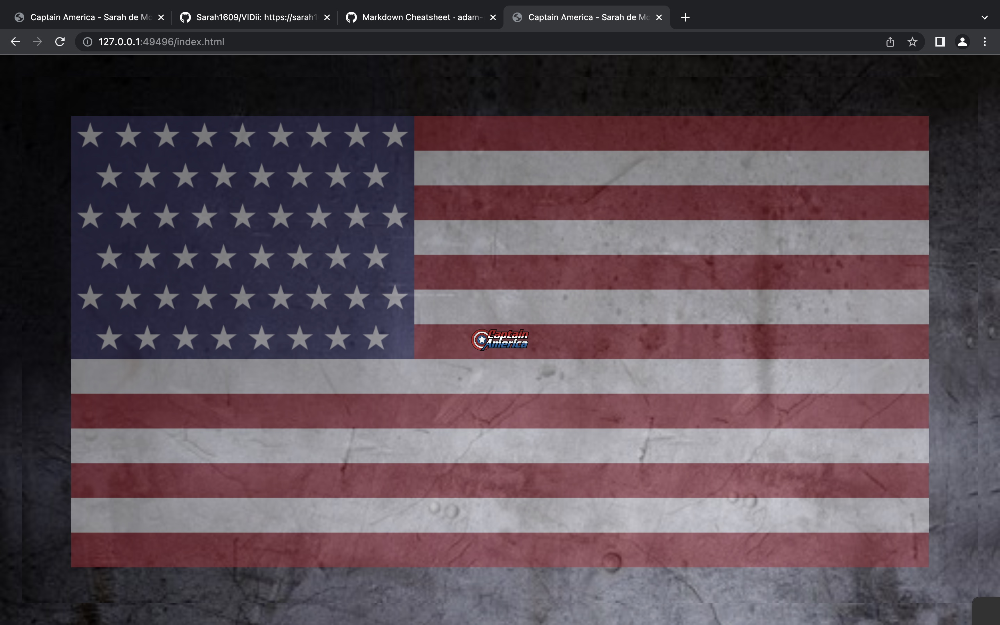
  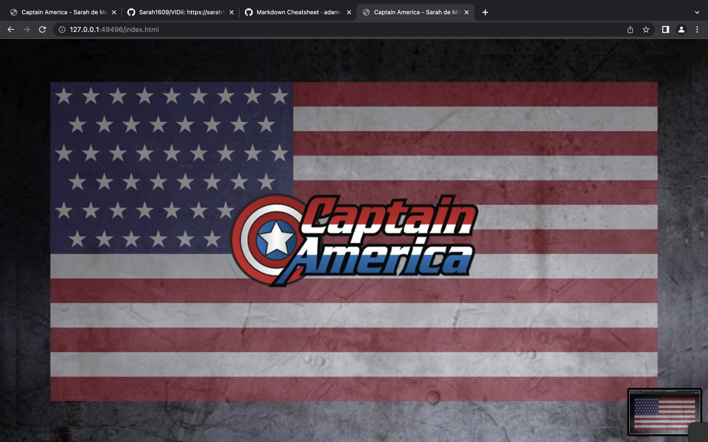

  ### Bevinding 5:
  Als feedback kreeg ik dat de informatiepagina nog geen button had waardoor de gebruiker terug kon komen naar de slider.

  #### oplossing:
  Om dit op te lossen heb ik bovenaan een button gemaakt in dezelfde stijl als alle andere buttons om terug te komen op de slider.

  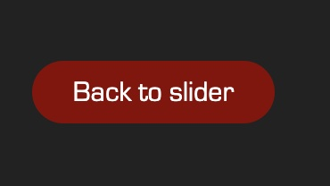

## Voortgang/Feedback 3

  
Wat is mijn voortgang na feedbacksessie 3?

  ### Bevinding 1:
  Als feedback kreeg ik te horen dat mijn concept nog te algemeen was. Captain America kwam niet echt terug in

  #### oplossing:
  Bij de startpagina heb ik de Amerikaanse vlag als eind-animatie weggehaald en het vervangen voor het schild van Captain America. Ik had hier best moeite mee omdat ik het schild niet goed over de Amerikaanse vlag kreeg nadat de eerste animatie gestopt was met het logo. Na wat hulp is het mij gelukt om met top:(calc) te werken en heb ik het mooi kunnen uitlijnen.

  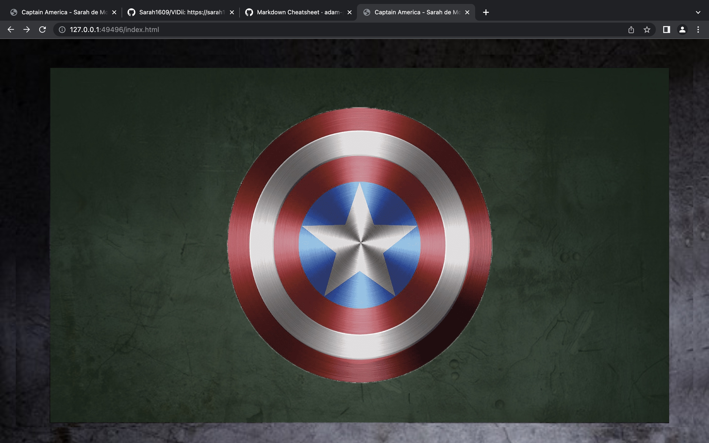
  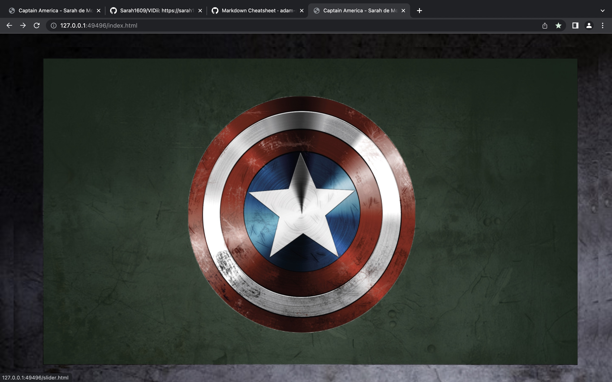

  ### Bevinding 2:
  Bij de informatiepagina had ik een extra tijdlijn staan. Sanne had aangegeven dat hij dit te standaard vond. Ik moest hier wat anders voor verzinnen.

  #### oplossing:
  Ik heb de extra tijdlijn vervangen voor een schild dat van de ene kant naar de andere kant rolt. Ik heb hiervoor gekozen zodat de informatiepagina ook wat meer in de stijl van Captain America valt.

  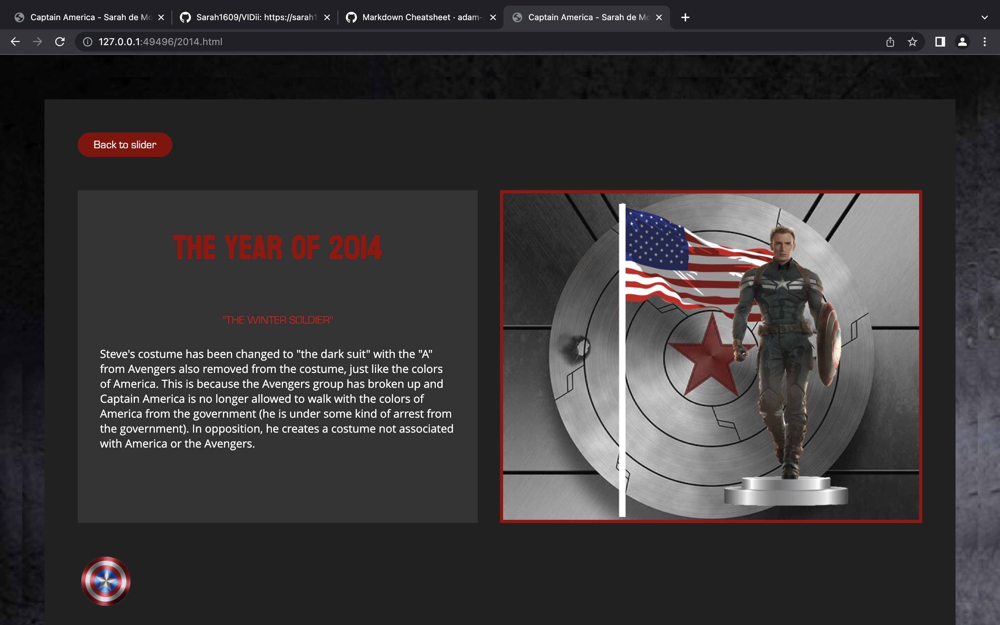
  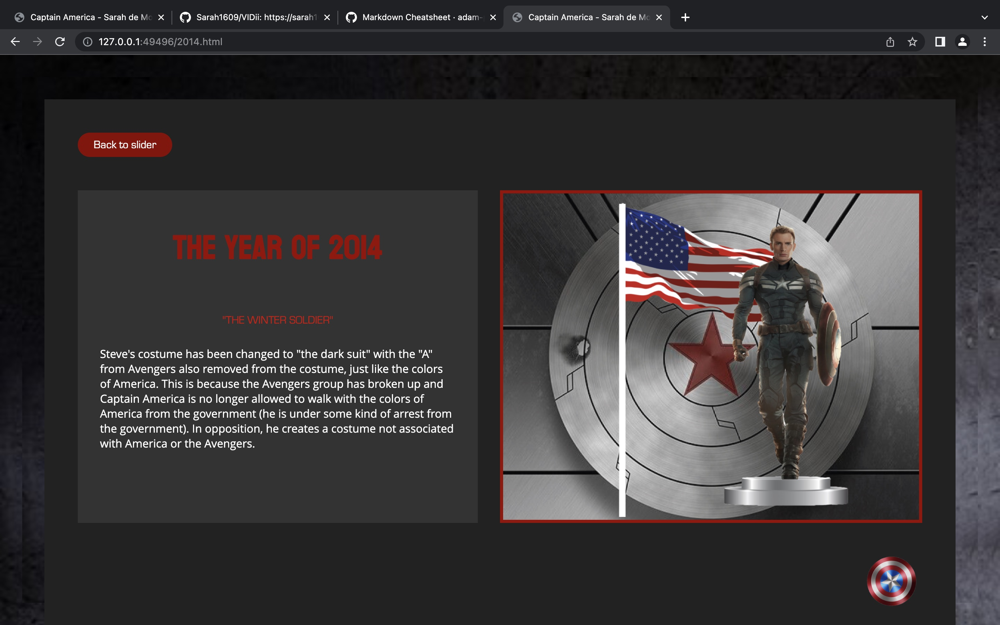

   ### Bevinding 3:
  De slider die ik gebruik als tijdlijn was nog te algemeen en sloeg niet echt op het concept van Captain America.

  #### oplossing:
  Captain America heeft een kenmerk en dat is zijn schild. Als oplossing om meer in het thema te komen heb ik in plaats van een rechte slider een ronde slider gemaakt met clip-path zodat het lijkt op het schild van Captain America.

  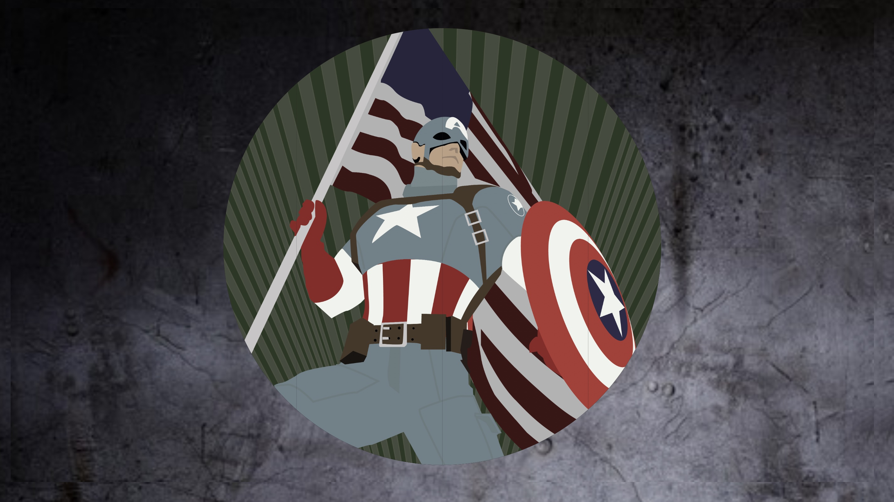

   ### Bevinding 4:
  Ik kreeg als feedback van Charlie dat de cursor nog een normaal pijltje had en dat ik dit ook nog kon veranderen in iets wat betrekking had tot Captain America.

  #### oplossing:
  Ik heb de cursor verandert naar het schild van Captain America.

  

   ### Bevinding 5:
   De afbeeldingen die ik in de verticale slider gebruikten passen niet meer in me nieuwe cirkel slider.

  #### oplossing:
  In Illustrator heb ik nieuwe achtergrond afbeeldingen gemaakt die meer passen in de nieuwe slider. Tijdens het maken van de slider kwam ik er ook achter hoe ik het probleem kon oplossen van mijn tekening die niet helemaal recht uitgelijnd in de cirkel staat. De afbeelding stond een beetje scheef waardoor het niet leek alsof het een rechte afbeelding was.

  <b>De oplossing was de tekengebieden tegen elkaar aan zetten in plaats van ruimte er tussen laten :)</b>

  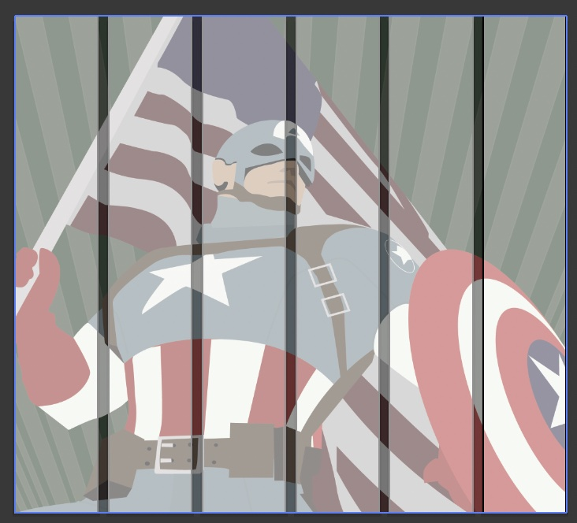
  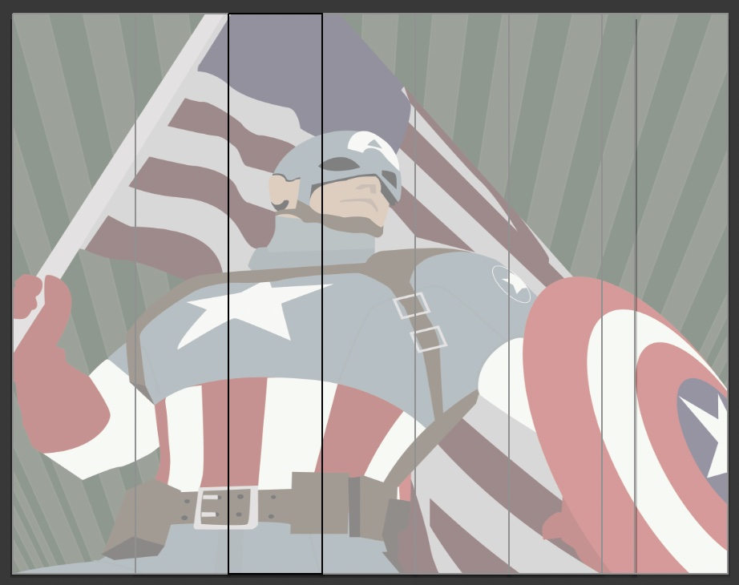

## Reflectie

  
Mijn eindresultaat & persoonlijke ontwikkeling

  ### Je uitkomst - karakteristiek screenshot(s):

  ### Dit ging goed/Heb ik geleerd:

  Alles wat betrekking heeft tot code en uiteindelijk werkt en er redelijk goed uit ziet ben ik tevreden mee. Coderen is een vak wat niet mijn ligging heeft en waar ik ook zeer gefrustreerd van raak.

  Het schrijven van de basiscode gaat mij naar mijn idee redelijk goed af (maar het is altijd nog afwachten wat Sanne er van vindt :)).

  Ik heb geleerd om geduld te hebben met betrekking tot code. Als je soms wat beter nadenkt is het niet zo moeilijk als je in eerste instatie dacht. Daarnaast heb ik geleerd om @keyframes en animaties op verschillende manieren in te zetten. Net als de background-images.

  Als tweede heb ik geleerd om nette code te schrijven en zo min mogelijk code te schrijven zodat het overzichtelijk blijft. Ik denk hierbij aan elementen die op 1 regel neergezet kunnen worden of dat niet alle elementen een class nodig hebben om deze elementen aan te roepen.

  Als derde heb ik geleerd om grids te gebruiken, wat overigens veel makkelijker is dan sections over elkaar heen zetten met position:absolute.

  ### Dit was lastig/Is niet gelukt:

  Ten eerste ben ik stom geweest en heb ik niet al mijn veranderingen opgeslagen, waardoor ik in mijn proces niet met foto's kan laten zien wat ik verandert heb. Hopelijk kan ik dit in het gesprek wel goed verwoorden :)

  Ik heb geprobeerd om met Javascript te werken om mijn buttons te animeren en om de poster te laten flippen maar dit is mij niet gelukt.

  Daarnaast vond ik sommige stukjes code die betrekking hadden tot @keyframes en animatie ook moeilijk. Ik heb een research gedaan op het internet maar hier kon ik geen bruikbare code vinden, ik had echt iemand anders ze hulp nodig. Mijn illustraties omzetten naar een SVG is me ook niet gelukt en is me tot nu toe nog steeds een raadsel hoe dit werkt :)

  Voor de basiscode vind ik dat het me wel redelijk goed af is gegaan. Ik merk wel aan mijzelf dat ik geen standaard nette code schrijf en ik mijn code ook echt moet controleren op hoe het staat. Dit vind ik af en toe lastig om bij te houden.

  Het idee dat ik had bedacht zag er op papier leuker uit dan dat het uiteindelijk gecodeerd was. Ik vond het moeilijk om te coderen in een bepaalde "stijl". Met deze stijl bedoel ik ook dat ik weinig inspiratie kon vinden over een leuke lay-out wat betrekking had tot Captain America. De reden hiervan zou ook kunnen zijn omdat ik te weinig nagedacht heb over wat ik precies wil voordat ik begon met coderen. Dit zorgde er ook uiteindelijk voor dat ik op het laatste moment nog dingen wilden wijzigen en anders wilden coderen. Ik heb ook meerdere keren feedback gevraagd aan 1 persoon.

  <b>Tip naar mijzelf - begin eerder, neem meer tijd om een concept uit te bedenken en vraag feedback aan meerdere personen!</b>

## Bronnenlijst

1. https://developer.mozilla.org/en-US/docs/Web/CSS/easing-function
2. https://stackoverflow.com/questions/52162148/css-how-to-start-one-keyframes-animation-after-other-one-finished
3. https://webplatform.github.io/docs/tutorials/css_animations/
4. https://zellwk.com/blog/style-hover-focus-active-states/
5.  https://codepen.io/shooft/pen/XWZKdgM?editors=0100
6.  https://codepen.io/shooft/pen/PoEEdBw
7.  https://codepen.io/shooft/pen/zYzdMwO
8.  https://codepen.io/shooft/pen/ExoMNVL
9.  https://codepen.io/shooft/pen/rNpPqNJ?editors=1100
10. https://codepen.io/shooft/pen/KKZYyZB?editors=1100
11. https://codepen.io/sarah1609/pen/yLvaeRw
12. https://codepen.io/shooft/pen/WNvGxeM
13. https://codepen.io/shooft/pen/KKZYyZB?editors=1100
14. https://css-tricks.com/lodge/svg/06-using-svg-svg-background-image/
15. https://css-tricks.com/video-screencasts/150-hey-designers-know-one-thing-javascript-recommend/
16. https://css-tricks.com/css3-gradients/
17. https://css-tricks.com/snippets/css/complete-guide-grid/
18. https://stackoverflow.com/questions/10835500/how-to-change-text-transparency-in-html-css
19. https://css-tricks.com/snippets/css/using-font-face-in-css/
20. https://css-tricks.com/snippets/css/stack-of-paper/
21. https://css-tricks.com/typewriter-animation-that-handles-anything-you-throw-at-it/

